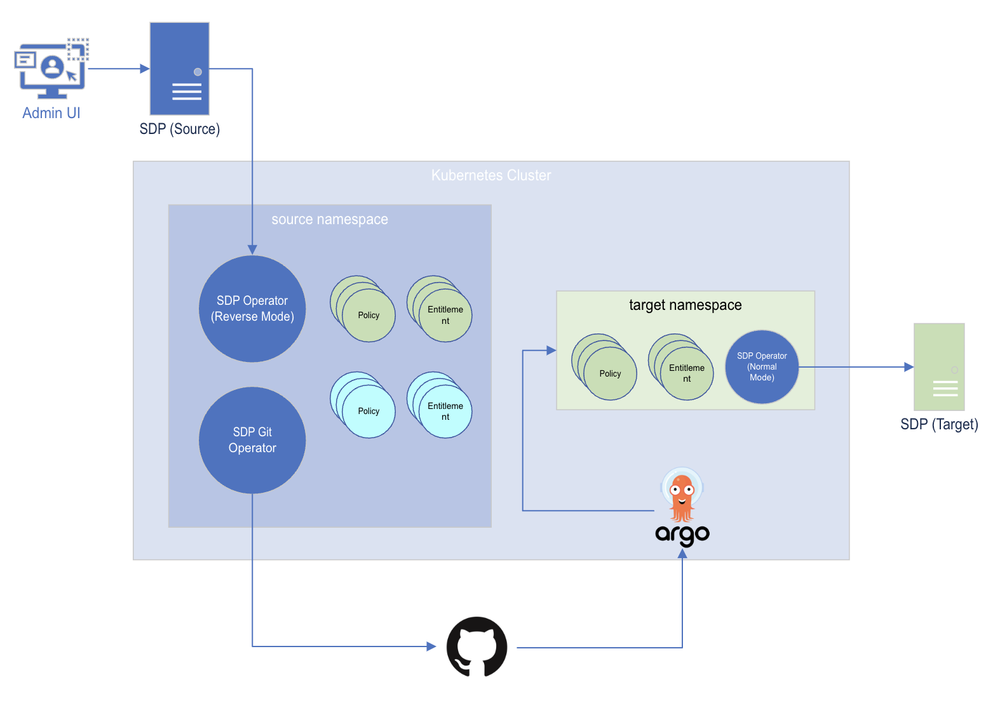

# GitOps with SDP Operator

## Overview
SDP Operator unlocks the power of GitOps to be able to declaratively configure your Appgate SDP system.

This example demonstrates how you can sync entities from Collective A to Collective B using GitHub Pull Requests as a way to control what entities are replicated between collectives.

We will be using the following applications/tools:
* Normal Operator
* Reverse Operator  
* Git Operator
* ArgoCD 
* GitHub 



1. User creates Policy and Entitlement on the Source SDP Admin UI
2. Reverse Operator pulls the Policy and Entitlement as CustomResources on Kubernetes into source namespace
3. Git Operator detects Policy and Entitlement in source namespace and dumps the YAML file into the git repository
4. Git Operator creates a Pull request to merge changes into master branch
5. User approves and merges the Pull Requestx
6. ArgoCD monitoring the master branch detects the YAMLs and applies the objects into the target namespace
7. Normal Operator detects Policy and Entitlement objects and pushes the entities to the Target SDP

## Setup

> Before starting the tutorial, please follow the [Getting Started - Prerequisite](../../README.md#prerequisite) 

### Table of Contents
* [Installing Reverse Operator](#install-reverse-operator) (for Source SDP)
* [Installing Git Operator](#install-git-operator)
* [Installing Normal Operator](#install-reverse-operator) (for Target SDP)
* [Testing](#test)

### Install Reverse Operator
The Reverse Operator pulls entities from the Source SDP into Kubernetes. 

Below is the values file used for this installation. We have enabled the Revers Mode by providing `reverseMode=true`. The `targetTag=["example"]` is to only sync entities tagged with `example` tag. Replace `host` and `deviceId` with appropriate values.
```yaml
sdp:
  sdpOperator:
    version: v18
    host: "<SOURCE_SDP_HOSTNAME>"
    deviceId: "<DEVICE_ID>"
    targetTags: ["example"]
    dryRun: false
    secret: source-operator-secret
    reverseMode: true
```

1. Create `source` namespace
   ```bash
   kubectl create namespace source
   ```
2. Create a secret containing Admin API credentials
   ```bash
   kubectl create secret generic source-operator-secret \
       --from-literal=appgate-operator-user="<USERNAME>" \
       --from-literal=appgate-operator-password="<PASSWORD>" \
       --namespace source
   ```
3. Install Reverse Operator, linking it to the Source SDP collective
   ```bash
   helm install source-operator appgate/sdp-operator \
       --values reverse.yaml \
       --namespace source
   ```

At this point, any entities tagged with `example` in the Source SDP collective will be synced into the `source` namespace.

### Install Git Operator
The Git Operator is responsible for dumping the entity YAMLs into a git repository and creating pull requests to merge the changes into the main branch. It does not interact with an SDP collective.

To install the Git Operator for GitHub, you need the following:
* SSH key recognized by the git repository
* GitHub personal token for creating pull requests

Below the values file used for this installation. We provide information about the git repository under `.sdp.gitOperators`. In our example, we are using GitHub as the vendor and creating pull requests into main branch of `appgate/example`.
```yaml
sdp:
  operators:
    - git-operator
  gitOperator:
    version: v18
    secret: github-operator-secret
    git:
      vendor: github
      mainBranch: main
      baseBranch: main
      repository: <ORGANIZATION_OR_USER/REPOSITORY>
```

1. Create a secret containing SSH key and GitHub token
   ```bash
   # GitHub
   kubectl create secret generic github-operator-secret \
       --from-literal=github-token="<GITHUB_TOKEN>" \
       --from-file=git-ssh-key="<SSH_KEY_PATH>" \
       --namespace source
   ```
2. Install the Git Operator for GitHub
   ```bash
   helm install git-operator appgate/sdp-operator \
       --values git.yaml \
       --namespace source
   ```

At this point, any changes done to entities tagged with `example` in the Source SDP collective will be reported in the pull request that is created by the git operator. 

### Install the Normal Operator
Normal Operator in our GitOps scenario will be responsible for pushing the entity to the Target SDP collective. Whenever a changes is merged on Git, ArgoCD will sync YAMLs to the `target` namespace where the operator is watching for events.  

Below is the values file used for this installation. The operator is configured to operator on entity tagged with `example` tag and is running on normal mode (`reverseMode=false`). Replace `host` and `deviceId` with appropriate values.
```yaml
sdp:
  sdpOperator:
    version: v18
    host: "<SOURCE_SDP_HOSTNAME>"
    deviceId: "<DEVICE_ID>"
    targetTags: ["example"]
    dryRun: false
    secret: target-operator-secret
    reverseMode: false
```

1. Create a secret containing Admin API credentials to the Target SDP
   ```bash
   kubectl create secret generic target-operator-secret \
       --from-literal=appgate-operator-user="<USERNAME>" \
       --from-literal=appgate-operator-password="<PASSWORD>" \
       --namespace source
   ```
2. Install Normal Operator, linking it to the Target SDP collective. 
   ```bash
   helm install target-operator appgate/sdp-operator \
       --values target.yaml \
       --namespace target
   ```

At this point, we can expect that any new entities created in `target` namespace gets pushed by the Normal Operator to the Target SDP collective. 

### Install ArgoCD
Follow official installation instructions: https://github.com/argoproj/argo-helm/tree/main/charts/argo-cd

ArgoCD acts as the link between the git repository and `target` namespace. It can monitor for changes in the git repository and sync YAMLs to a Kubernetes namespace. 

After install, complete the following:
1. [Add your git repository into ArgoCD](https://argo-cd.readthedocs.io/en/stable/user-guide/private-repositories/#ssh-private-key-credential)
2. [Create an Argo Application](https://argo-cd.readthedocs.io/en/stable/getting_started/#creating-apps-via-ui) by setting the source to your git repository, setting `main` as the branch, and setting the destination namespace to `target`.
3. ArgoCD should now begin syncing changes merged into the git repository as a result of the git operator's pull requests.

## Test
1. Create a Policy tagged with `example` in the Source SDP Collective
2. Verify that a pull request gets created for new Policy
3. Approve the pull request and merge the changes to the main branch
4. Verify that ArgoCD applies the Policy in the `target` namespace
5. Verify that the same Policy entity gets created in the Target SDP Collective
