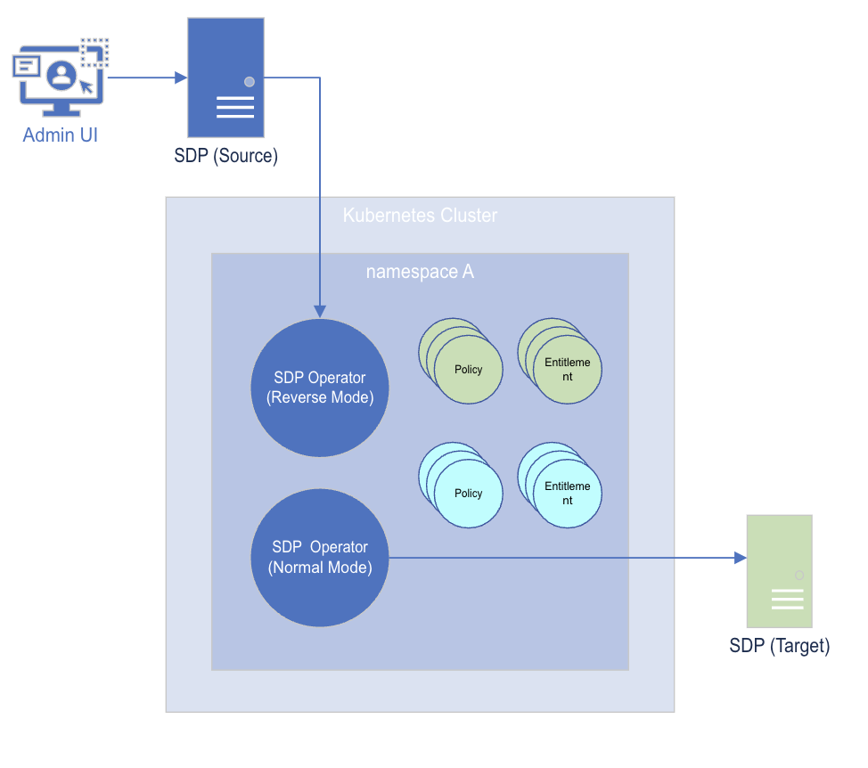

# Sync from Collective A to Collective B

## Overview
This example demonstrates how you can sync entities from Collective A to Collective B 

We will be using the following applications/tools:
* Normal Operator
* Reverse Operator




1. User creates new Policy and Entitlements in Source SDP collective
2. Reverse Operator pulls Policy and Entitlement into namespace A
3. Normal Operator pushes Policy and Entitlements to Target SDP collective

## Setup

> Before starting the tutorial, please follow the [Getting Started - Prerequisite](../../README.md#prerequisite) 

### Table of Contents
* [Installing Source Operator](#install-source-operator)
* [Installing Target Operator](#install-target-operator)

### Install Source Operator
The Reverse Operator pulls entities from the Source SDP into Kubernetes. 

Below is the values file used for this installation. We have enabled the Revers Mode by providing `reverseMode=true`. The `targetTag=["example"]` is to only sync entities tagged with `example` tag. Replace `<SOURCE_SDP_HOSTNAME>` and `DEVICE_ID`. 
```yaml
sdp:
  sdpOperator:
    version: v18
    host: "<SOURCE_SDP_HOSTNAME>"
    deviceId: "<DEVICE_ID>"
    targetTags: ["example"]
    dryRun: false
    secret: source-operator-secret
    reverseMode: true
```

1. Create `sdp-demo` namespace
   ```bash
   kubectl create namespace source
   ```
2. Create a secret containing Admin API credentials to the Source SDP
   ```bash
   kubectl create secret generic source-operator-secret \
       --from-literal=appgate-operator-user="<USERNAME>" \
       --from-literal=appgate-operator-password="<PASSWORD>" \
       --namespace sdp-demo
   ```
3. Install Reverse Operator, linking it to the Source SDP collective
   ```bash
   helm install source-operator appgate/sdp-operator \
	   --set sdp.operator.host="<SOURCE_SDP_HOSTNAME>" \
	   --set sdp.operator.deviceId="<DEVICE_ID>" 
       --values source.yaml \
       --namespace sdp-demo
   ```

### Install Target Operator
Normal Operator in our GitOps scenario will be responsible for pushing the entity to the Target SDP collective. Whenever a changes is merged on Git, ArgoCD will sync YAMLs to the `target` namespace where the operator is watching for events.  

Below is the [values file](target.yaml) used for this installation. The operator is configured to operator on entity tagged with `example` tag and is running on normal mode (`reverseMode=false`). Replace `<TARGET_SDP_HOSTNAME>` and `DEVICE_ID`. 
```yaml
sdp:
  sdpOperator:
    version: v18
    host: "<TARGET_SDP_HOSTNAME>"
    deviceId: "<DEVICE_ID>"
    targetTags: ["example"]
    dryRun: false
    secret: target-operator-secret
    reverseMode: false
  
```

1. Create a secret containing Admin API credentials to the Target SDP
   ```bash
   kubectl create secret generic target-operator-secret \
       --from-literal=appgate-operator-user="<USERNAME>" \
       --from-literal=appgate-operator-password="<PASSWORD>" \
       --namespace sdp-demo
   ```
2. Install Normal Operator, linking it to the Target SDP collective. 
   ```bash
   helm install target-operator appgate/sdp-operator \
       --values target.yaml \
       --namespace target
   ```

At the point, the entire setup is complete. Any entity tagged with `example` is created on the Source SDP, the entity is synced to the Target SDP Collective.  


## Test
1. Create a Policy tagged with `example` in the Source SDP Collective
2. Verify that the same Policy entity gets created in the Target SDP Collective
